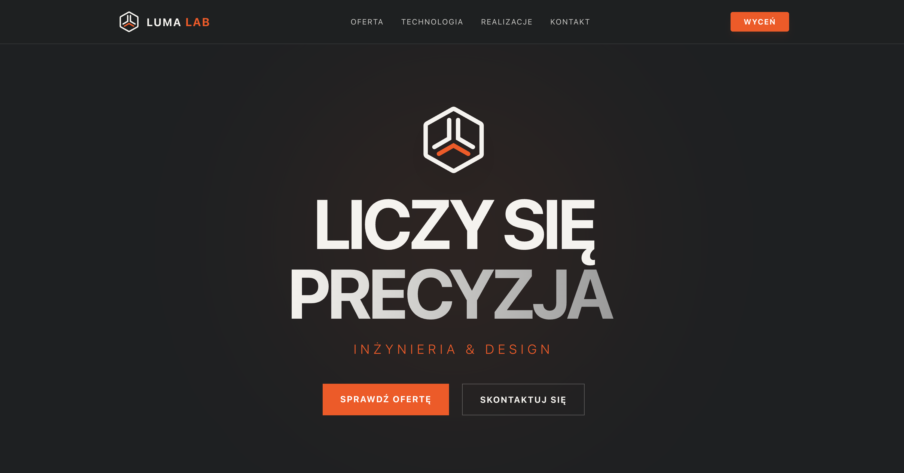

# 🔬 Luma Lab — Engineering & Design


> **Official repository for Luma Lab.** A high-performance landing page for an engineering studio specializing in laser cutting, 3D printing, and CAD design.



## About The Project

Engineered with a focus on performance and industrial aesthetic. This project demonstrates a modern, bloat-free approach to web development, fully optimized for Cloudflare's Edge Network.

**Key Features:**
* **Design:** Minimalist, industrial aesthetic.
* **Performance:** Static Export (SSG) + Edge Network (Cloudflare Pages).
* **Motion:** Subtle, physics-based entrance animations (Framer Motion).
* **Responsive:** Fully adaptive layout for mobile and desktop.
* **Contact:** Custom integrated contact form with validation.

## 🛠️ Tech Stack

| Category | Technology |
| :--- | :--- |
| **Core** | Next.js 16 (App Router), React 19 |
| **Language** | TypeScript |
| **Styling** | Tailwind CSS v4 |
| **Animation** | Framer Motion |
| **Deployment** | Cloudflare Pages (Direct Git Integration) |

## 📂 Project Structure

```bash
luma-lab/
├── public/              # Static assets (images, vectors)
├── src/
│   ├── app/             # Next.js App Router
│   │   ├── oferta/      # Offer / Services Page
│   │   ├── technologia/ # Available technologies
│   │   ├── realizacje/  # Previous projects
│   │   ├── kontakt/     # Contact Page
│   │   ├── layout.tsx   # Root Layout (Navbar + Footer)
│   │   └── page.tsx     # Homepage (Hero + Features)
│   ├── components/      # Reusable UI Components
│   └── lib/             # Utilities
├── next.config.ts       # Next.js Configuration
└── wrangler.json        # Cloudflare Pages Configuration